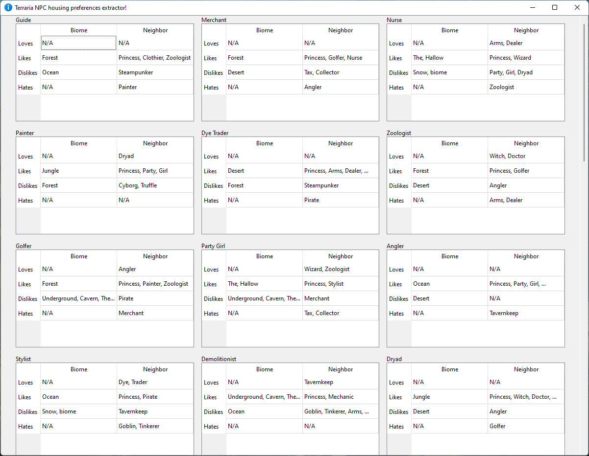

# Terraria Living Preferences Scraper

---

### Description

Optimal NPC housing in Terraria requires you to understand an individual NPC's living preferences, which boil down to biome and neighbor preference. Right now, this information is stored on individual pages per NPC on the Terraria wiki, so I decided to write this web scraper which basically automates the lookup of this information and presents it in a nice way.

The scraper basically goes to the Terraria NPCs general page and then discovers the links to all individual NPC pages, after which it scrapes the living preferences tables from the HTML. 

The gui is done using PyQt6, and I've refrained from applying my own styling to the app, so, for now, it will be using OS-specific style.

---

### How to run

Run main.py without arguments, then proceed through the gui. Note that std-out is still going to the terminal.

---